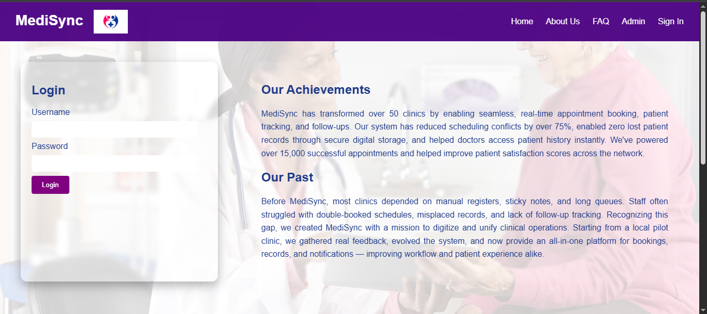
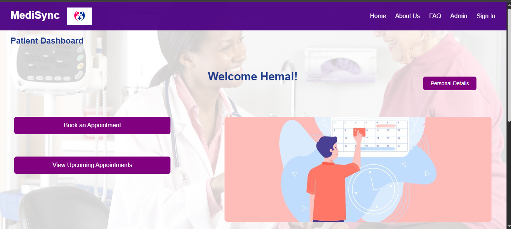
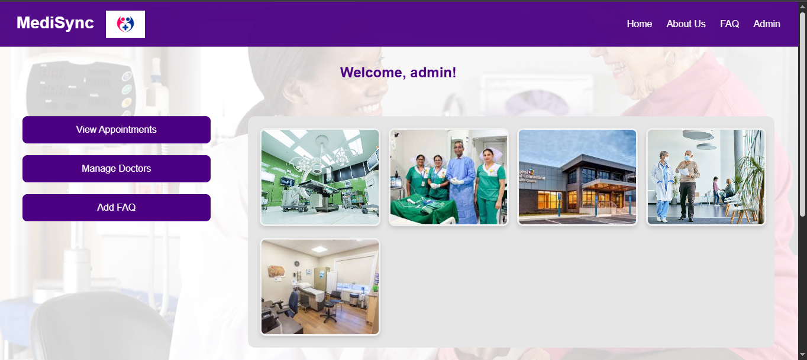

# MediSync – Clinic Appointment System
> A full‑stack Java + MySQL web application that lets patients book appointments online while giving clinic staff a clean dashboard to manage doctors, schedules, and patient records.  
> Built as a second‑year university project to practise **Java Servlets, JSP, JDBC, and relational‑database design**.
> ---

## ✨ Features

- **User Authentication**  
  Secure login and registration for patients, staff, and administrators.

- **Appointment Booking**  
  Patients can book, view, or cancel appointments with available doctors.

- **Doctor Management**  
  Admins can add, update, and remove doctors and assign departments/schedules.

- **Dashboard View**  
  Role-based dashboards show relevant information for patients and admins.

- **Search & Filter System**  
  Search doctors by name, specialization, or availability.

- **Secure Role-Based Access**  
  Different functionalities and views for patients and admins.

- **Appointment History**  
  Patients can track past visits; admins can see appointment logs.

- **Responsive UI**  
  Optimized for both desktop and mobile screens.

## 🗂️ Project Structure

```
medisync/
├── src/main/java/com/medisync/
│   ├── controller/       # Servlets for handling requests
│   ├── dao/              # DAO classes for CRUD operations
│   ├── model/            # Plain JavaBeans (User, Doctor, Appointment…)
│   ├── service/          # Business logic
│   └── util/             # DB connection, constants, helpers
├── src/main/webapp/
│   ├── css/              # All CSS files
│   ├── images/           # All images
│   ├── index.jsp/        # Home page jsp file
│   ├── admin.jsp/        # Admin Home page
│   ├── faq.jsp/          # Pateints' related FAQs
    ├── about.jsp/        # About Us - page 
│   ├── signUp.jsp/       # Sign up form page
│   ├── other jsp files/  # Other related jsp files redirect from main jsps.
│   └── WEB-INF/          # web.xml, libraries
└── structure.txt
```


---

## 🚀 Getting Started

### Prerequisites

* **Java 8+**  
* **Apache Tomcat 9+**  
* **MySQL 5.7 / 8.0**  
* (Optional) **Maven** for build automation

### 1️⃣ Clone the Repository

```bash
git clone https://github.com/pimashi22/clinic-appointment-system.git
cd clinic-appointment-system
```

### 2️⃣ Database Setup

#### 📌 Step 1: Create the Database

Open your MySQL client (MySQL Workbench, phpMyAdmin, or CLI) and run the following SQL:

```sql
CREATE DATABASE medsync;
```

#### 📌 Step 2:Update the database credentials in DBUtil.java if needed:

URL: jdbc:mysql://localhost:3307/medsync
USER: root
PASSWORD: Pn2002@

#### 📌 Step 3:Update the database credentials in DBUtil.java if needed:

Import the required tables and sample data (see your SQL scripts).

### 3️⃣ Build & Deploy

#### ⚙️ Step 1: Import the Project into Eclipse

- Open Eclipse
- Go to: **File > Import > Existing Projects into Workspace**
- Select your project folder (the cloned GitHub repo)
- Click **Finish**

If it's not recognized as a Web project:

- Right-click the project → **Properties > Project Facets**
- Enable:
  - ✅ Java
  - ✅ Dynamic Web Module

---

#### ⚙️ Step 2: Add Required JAR Libraries

Make sure these libraries are added inside:  
`WebContent/WEB-INF/lib/` or `src/main/webapp/WEB-INF/lib/`

---

#### ⚙️ Step 3: Set Up Apache Tomcat in Eclipse

- Go to: **Window > Show View > Servers**
- Right-click in the Servers tab → **New > Server**
- Choose your Tomcat version (e.g., Tomcat 9) and click **Next**
- Browse your Tomcat installation directory and finish setup

Now:

- Right-click on the server → **Add and Remove**
- Add your project to the server and click **Finish**

---

#### ⚙️ Step 4: Run the Application

- Right-click your project in Eclipse
- Select: **Run As > Run on Server**
- Once Tomcat starts, open your browser: http://localhost:8080/medisync/

---

## 🧑‍💼 Usage

- 📝 Register or log in as a **patient** to book appointments and view personal details.
- 🗓️ Patients can **book**, **view**, and **cancel** appointments.
- 👨‍⚕️ Admins can **add doctors**, manage FAQs, and view all appointments.
- 🧭 Sidebar navigation with **role-based views** ensures simple access for each user type.

---

## 🧪 Technologies Used

- 💻 Java (Servlets & JSP)
- 🛢️ MySQL
- 🧩 JSTL
- 🌐 HTML5, CSS3 (custom styles)
- 🖥️ Apache Tomcat

---

## 👩‍💻 Author

**Pimashi Nipulee**  
🔗 [GitHub Profile](https://github.com/pimashi22)

---

## 📜 License

This project is for **educational purposes** only.  
You're welcome to fork or build upon it for academic or personal learning.

---

## 🖼️ Screenshots

### 🏠 Homepage



---

### 📅 Patient Dashboard



---

### 🧑‍⚕️ Admin Dashboard




